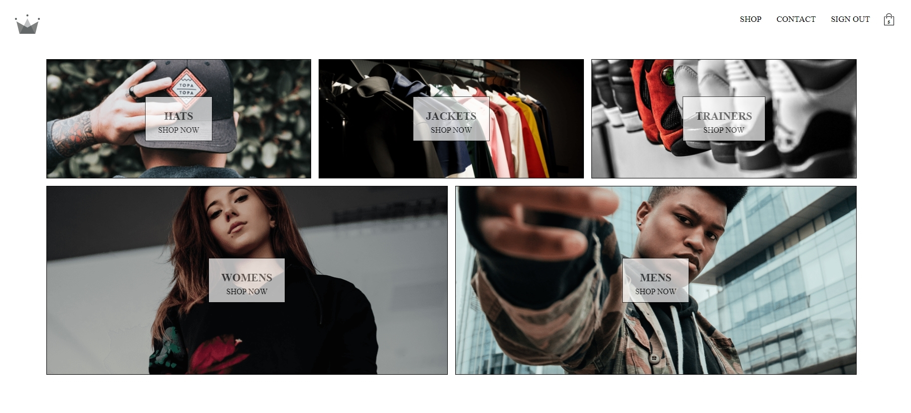

## Getting Started

Once cloned or downloaded, use npm install command in the terminal at root level and then npm run start. You should then be able to view the application in the browser at http://localhost:3000/ or you can view it running at this link https://clothing-store-100.herokuapp.com/

## Brief

Create clothing store with basket to add and remove items as well as taking payments, ContextAPI re-factor.

Using React, Context API, SASS, Firebase for authentication and storing shop data, stripe for payments.

# Project Title

Clothing store

## Built With

JavaScript, React, ContextAPI, redux-thunk, SASS, Firebase
